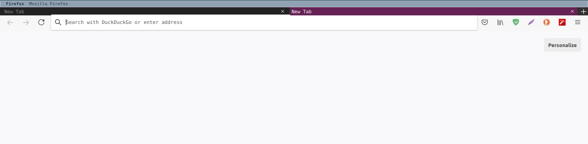

# i3wm-firefox-theme




The theme is checked on Ubuntu 20.4 LTS with i3wm

Thanks to [Firefox i3wm Theme](https://github.com/aadilayub/firefox-i3wm-theme) & [Slick-Fox](https://github.com/Etesam913/slick-fox) for the idea 

* `F6` slides down the navigation bar with url selection 

## Installation

Find Mozilla firefox directory type in url: `about:support`

In `Applicaton Basics` look for `Profile Directory` and click the `Open Directory`

Once in directory look for the folder `chrome` if there is no such directory, create one:

if using Terminal:

```
mkdir -p chrome
```

Go to the directory `chrome/` and create the file `userChrome.css`

Copy and Paste the contents of userChrome.css

__OR__

`git clone https://github.com/mirbehroznoor/i3wm-firefox-theme`

Paste the `userChrome.css` file in `chrome/` folder

Restart Firefox to enjoy your new theme

## In case of failure:

type in url `about:config`

type `toolkit.legacyUserProfileCustomizations.stylesheets` set it to __TRUE__


# Advice

Remember there are no __one-size-fits-all__ theme 

Have Fun Experimenting 
